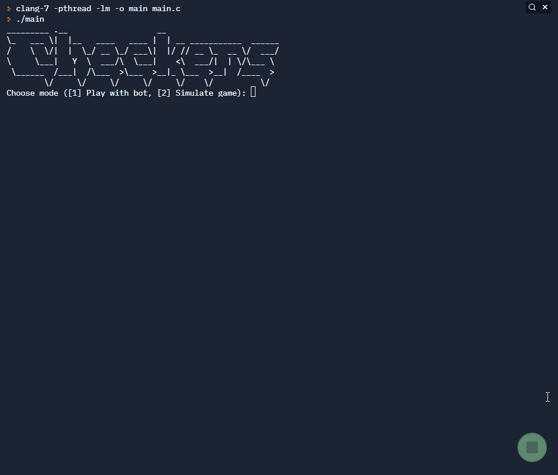

<h1 align="center">Checkers Game and Player</h1>

```
_________ .__                   __
\_   ___ \|  |__   ____   ____ |  | __ ___________  ______
/    \  \/|  |  \_/ __ \_/ ___\|  |/ // __ \_  __ \/  ___/
\     \___|   Y  \  ___/\  \___|    <\  ___/|  | \/\___ \ 
 \______  /___|  /\___  >\___  >__|_ \___  >__|  /____  > 
        \/     \/     \/     \/     \/    \/          \/
```
> Play a game of checkers with a Minimax bot

## [Live Demo](https://replit.com/@unixc/cli-checkers?embed=1&output=1#.replit)
> hosted on repl.it (makes sure to press the green triangle at the bottom right corner to run the program)



## Technologies Used
* C
  * `stdlib.h`, `stdio.h`, `limits.h`, `assert.h`, `string.h`
* Programming Concepts
  * Dynamic Memory Allocation
    * `malloc()`, `free()`
  * Recursion
    * `minimax(...)` is a recursive function
  * Linked Lists
  * Structs

## Installation
> if you do not intend on ammending the code or adding additional players, you might want to use the [Live Demo](https://replit.com/@unixc/cli-checkers?embed=1&output=1#.replit) instead
1. Make sure that a C Compiler is installed on your system (eg. Clang, GCC, etc.)
2. Clone the repository or Download the ZIP file
    ```
    git clone https://github.com/chuahxinyu/cli-checkers.git
    ```
3. Compile and run `checkers.c`
   - Compiling Command: `gcc -Wall -ansi -o checkers checkers.c`
   - Running Command: `./checkers`

## Modes and Configuration
* Mode 1: Play with bot
  * human vs computer mode
* Mode 2: Simulate game
  * input a list of actions and an optional command (A or P)
  * command A: computes the next action
  * command P: computes the next 10 actions
  * example inputs in `\testcases`
* Input action format:
  * `col1row1 - col2row2`
  * eg. B3-C4
* Computed Actions
  * `***` signifies a computed action
  * actions are computed using the Minimax Algorithm at depth 3
  * depth can be changed (marked with `☚`)
    ```c
    ...
    // minimax
    #define COST_PIECE          1       // one piece cost
    #define COST_TOWER          3       // one tower cost
    #define TREE_DEPTH          3       // minimax tree depth ☚
    #define ROOT_DEPTH          0       // the root depth
    ...
    ```
